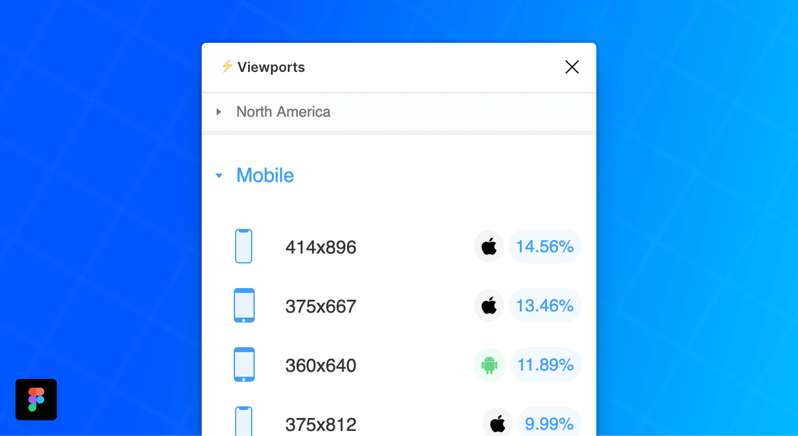

  
   
   
   
    

# Viewports client

**Viewports is a [Figma](https://figmac.com/) plugin**

_Make sure that your designs are covering a reasonable share of the market. Select one or more frames and Viewports will let you change their sizes to your preferred display. Simple!_

[Viewports](https://www.figma.com/community/plugin/732240841094697441/Viewports) is a rather simple React App which dynamicaly displays a list popular viewports on the market (together with its market share). It is downlading the data from [viewports-server](https://github.com/rojcyk/viewports-server).

# Installation

Is quite simple and there is not much to it.

1. Clone the repo
2. Create a [manifest.json file](https://www.figma.com/plugin-docs/manifest/) and add it to the repo _(.gitignore it though)_
3. Install the requirements with `npm install` or `yarn install`
4. Watch the files with `yarn dev` command
5. Or make a production build with `yarn build`
6. Load and develop the app in [Figma Desktop app](https://www.figma.com/downloads/)
